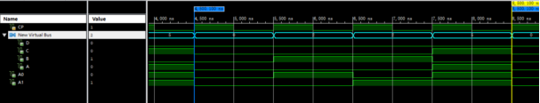

# Dynamic 7-Segment Display (Verilog HDL)

基于 Verilog HDL 的动态数码管显示系统

## 项目简介
使用 Verilog HDL 设计的动态七段数码管显示系统，实现多位数字的动态刷新显示。

## 功能特性
- 动态扫描驱动多位数码管
- 状态机控制显示逻辑
- 时序逻辑模块化设计

## 开发环境
- 语言：Verilog HDL
- 工具：Vivado / ISE
- 仿真：功能仿真 + 波形验证

## 文件结构
- `top.v` — 顶层模块
- `display_ctrl.v` — 显示控制模块
- `seg_decoder.v` — 段码译码模块
## 仿真波形

